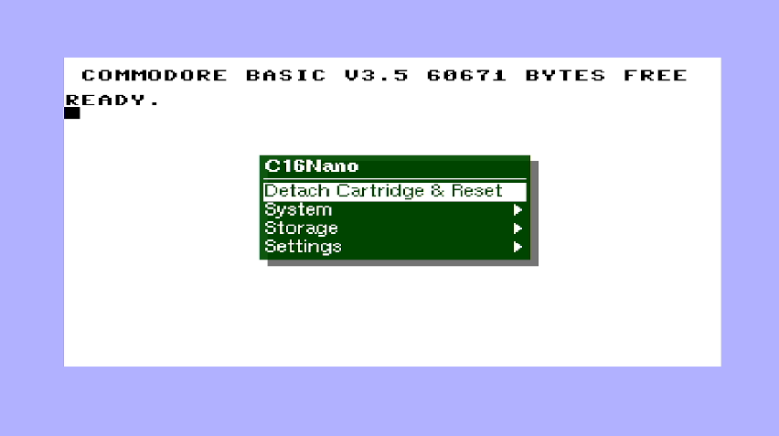

# C16Nano
Commodore C16 Plus/4 core for Tang FPGA boards

The C16Nano is a port of the [MiSTer](https://github.com/MiSTer-devel/C16_MiSTer) core with numerous changes (DRAM, TED etc.) for the [C16](https://en.wikipedia.org/wiki/Commodore_16) homecomputer:

| Board      | FPGA       | support |Note|
| ---        |        -   | -     |-|
| [Tang Console 60K NEO](https://wiki.sipeed.com/hardware/en/tang/tang-console/mega-console.html)|[GW5AT-60](https://www.gowinsemi.com/en/product/detail/60/) | HDMI / LCD |no D9 Joystick|
| [Tang Nano 20k](https://wiki.sipeed.com/nano20k)     | [GW2AR](https://www.gowinsemi.com/en/product/detail/38/)  | HDMI |dual D9 Joystick / ext IEC|

This project relies on a MPU being connected to the FPGA (onboard BL616 or external one). --> [MiSTle-Dev wiki](https://github.com/MiSTle-Dev/.github/wiki) <--  



## Features

This port has the following changes and enhancements:

* TED core 1.9
* PAL 720x576p@50Hz / NTSC 720x480p@60Hz HDMI Video and Audio Output
* Choose between C16 (64KB) and Plus/4
* Cartridge support (*.bin) for Plus/4 model
* loadable Function ROM (*.bin) for Plus/4 model
* emulated [1541 Diskdrive](https://en.wikipedia.org/wiki/Commodore_1541) on FAT/extFAT microSD card
* external IEC device (C1541 Floppy / IEC Printer etc.)
* direct BASIC program (*.PRG) injection loader with automatic start
* Tape (*.TAP) image loader as [Datasette](https://en.wikipedia.org/wiki/Commodore_Datasette)
* loadable 16k Kernal ROM
* loadable C1541 DOS as selection from Tang Flash memory
* Joystick with swap function
* 2 x [legacy D9 Joystick](https://en.wikipedia.org/wiki/Atari_CX40_joystick) (Atari / Commodore digital type)
* [USB Joystick](https://en.wikipedia.org/wiki/Joystick) or [USB Gamepad](https://en.wikipedia.org/wiki/Gamepad) or 
[USB XBOX 360 Controller](https://en.wikipedia.org/wiki/Xbox_360_controller) as Joystick
* Joystick emulation on Keyboard Numpad
* [6551 UART](https://en.wikipedia.org/wiki/MOS_Technology_6551) WIFI / LAN Modem Interface to FPGA-Companion up to 19200 Baud

Original C16 core by [Istvan Hegedus](https://github.com/ishe). See also the [hackaday](https://hackaday.io/project/11460-fpgated) article. 

### Cartridge ROM and Function ROM

ROMS can only be used in the Plus/4 operation mode (OSD selection). Function ROM can be of any language.  
16k ROMs can be loaded as such. If there is both low and high ROM then the two files need to be combined first into a single 32k (low + high) file and stored on SDcard.

```shell
cat 3-plus-1.317053-01.bin 3-plus-1.317054-01.bin > function.bin
cat t112003_calc_plus_lo.bin t112003_calc_plus_hi.bin > calc_plus.bin
```

## Tape Image Loader (*.TAP)

A [Tape](https://en.wikipedia.org/wiki/Commodore_Datasette) *.TAP file can be loaded via OSD file selection.  

> [!IMPORTANT]
> command: **LOAD**

Then select from OSD a *.tap file.    
Screen will blank 'blue' and after a short period of time a filename will appear for some seconds.  
Screen will blank 'blue' again until tape file is entirely loaded. It takes time...
